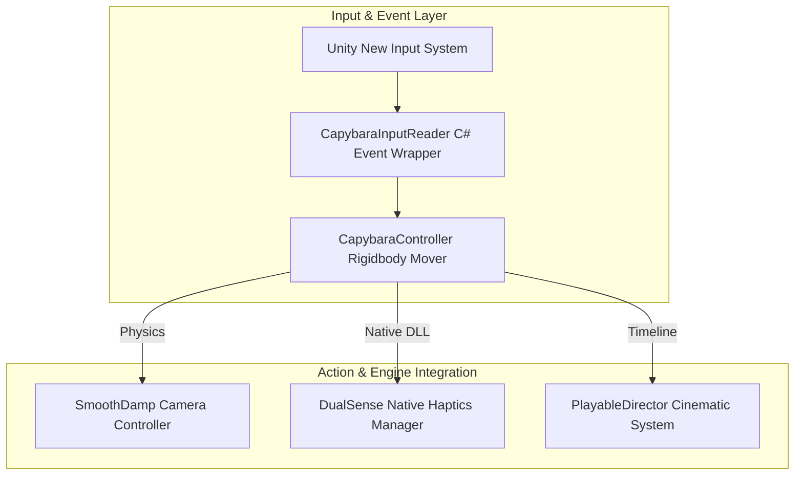

## 게임의 핵심 컨셉 및 스토리 요약

XSBD 두 번째 인하우스 프로젝트로, 프로그래머들의 역량을 보여줄 수 있도록 프로젝트로 설계 및 개발되었습니다. 다양한 컨텐츠를 통합된 프레임워크로 개발하며 복잡한 다수의 컨텐츠를 효율적으로 개발하는 능력을 쇼케이싱하는 데 주안점을 두었습니다.

## 메인 게임플레이 루프 및 핵심 메커니즘

돌아가신 할머니를 그리워하며 하룰라라로 떠나는 주인공 카피바라 '캐피'의 여정을 그린 3D 힐링 어드벤처 & 플랫포머 게임입니다. 장애물 회피 글라이딩(Gliding), 시각화된 반향정위를 활용한 플랫포밍, 굴러오는 돌 피하기, 슬라이딩(스키) 등 기믹별 액션과 PS5 DualSense 햅틱 피드백 연동을 핵심 시스템으로 삼고 있습니다.

### 시스템 아키텍처 다이어그램

## 적용된 개발 방법론

1주 단위 애자일 스프린트 및 주 2~3회 스크럼 개발 방법론 (1-Week Agile Sprint & 2-3 Times Weekly Scrum)

XSBD의 두 번째 인하우스 프로젝트로서 다양한 컨텐츠와 복잡한 기믹을 통합 프레임워크 상에서 개발하기 위해 1주 단위 애자일 스프린트와 주 2~3회 스크럼 미팅을 진행했습니다. 스프린트 회의를 통해 지난 주차 작업 내역을 확인하고 프로젝트 완성을 위한 기능 요구사항과 백로그를 정밀 산정했습니다.

또한 리스크 관리와 즉각적인 소통을 위해 디스코드(Discord)와 카카오톡(KakaoTalk) 2개 이상의 소통 채널을 운용하여 실시간으로 이상 유무를 공유하며 개발을 진행했습니다.

## 구현에 필요했던 주요 시스템 목록

이를 위해 다음 시스템들을 만들었습니다:
1. New Input System 추상화 기반의 입력-동작 분리 이벤트 아키텍처
2. 글라이딩 중력/공기저항 연산 및 Rigidbody 기반의 물리 이동 컨트롤러
3. DualSense Windows Native DLL 연동 및 AnimationCurve 기반 액션 햅틱 피드백 시스템
4. PlayableDirector 및 타임라인(Timeline) 연동 시네마틱/엔딩 연출 제어 시스템
5. Animator.StringToHash 캐싱 및 파라미터 최적화를 통한 렌더링/애니메이션 성능 제어

## 핵심 시스템의 세부 구현 방식

설계 측면에서는 Unity New Input System의 CallbackContext를 캐릭터 컨트롤러에 직접 노출하지 않고, C# Event(Action)로 중간에서 래핑 변환하는 추상화 구조를 도입하여 단일 책임 원칙(SRP)을 철저히 준수했습니다. 이동 및 회전 로직은 FixedUpdate에서 물리 엔진 기반으로 처리하고 SmoothDamp 알고리즘을 적용하여 화면 떨림 없는 자연스럽고 부드러운 카메라/캐릭터 회전을 구현했습니다. 또한, 수영이나 특수 액션 시 PS5 컨트롤러의 세밀한 햅틱 트리거와 커스텀 진동 패턴(SwimRumbleCurve)을 연동해 높은 조작감과 시네마틱 연출 품질을 완성했습니다.

## 개발 후기

입력 추상화 이벤트 구조와 물리 기반 이동 로직, 그리고 Native DLL 연동을 통한 콘솔급 햅틱 피드백 시스템까지 조화롭게 결합하여 뛰어난 몰입감을 갖춘 3D 어드벤처 게임의 아키텍처를 완성해 본 경험이었습니다.

## 시연 영상 및 관련 링크

* 🎬 [[25 Portfolio] Capy, Capy, Capybara - Levels](https://www.youtube.com/watch?v=zoUV3IXGhJY)