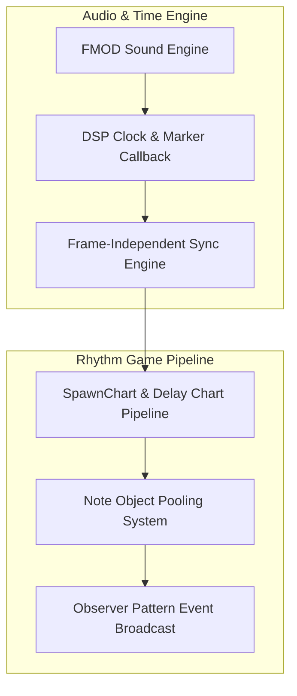

## 게임의 핵심 컨셉 및 스토리 요약

XSBD에서 경희대학교 예술디자인대학교 디지털콘텐츠학과 교수님들과의 협의 하에 해당 학과 학생 졸업작품 제작 지원을 진행한 사례입니다. 리듬 게임이라는 기획 주제에 맞춰 정확하고 공정한 판정이 가능한 시스템을 구현하고, 그를 기반으로 화면에 보여지는 이펙트(입력에 따라 토막나는 고등어나 껍질이 벗겨지는 견과류 등)를 구현하여 노트가 아닌, 캐릭터의 동작을 기반으로 한 리듬 게임을 구현하였습니다.

## 메인 게임플레이 루프 및 핵심 메커니즘

요리사 주인공이 찾아오는 동물 손님들의 요구와 기호에 맞춰 재료를 요리하는 리듬 게임입니다. 동물별 곡에 맞춰 BPM 값을 입력하고, 그에 맞춰 비트가 정확히 흘러나와야 하는 오디오-입력 간 수학적 엄밀성에 집중하여 설계되었습니다. 프레임 드롭에 영향을 받지 않는 완벽한 오디오 시간 동기화와 노트 생성/판정 시차 계산, 그리고 지속적인 부드러움을 위한 메모리 최적화를 메인 게임플레이 루프로 삼고 있습니다.

## 적용된 개발 방법론

1주 단위 애자일 스프린트 및 이중 소통 채널 기반 협업 프로세스 (1-Week Agile Sprint & Dual-Channel Collaboration)

프로젝트를 1주 단위의 짧은 애자일 스프린트(Agile Sprint)로 나누어 진행했습니다. 정기 스프린트 회의를 통해 지난 주차의 상세 작업 내역을 리뷰하고, 프로젝트 완성을 위해 필요한 기능적 요구사항과 백로그를 정밀하게 산정해 다음 주차 일정에 할당했습니다.

또한 개발 진행 중 이슈나 미처 예상치 못한 문제로 인해 불필요한 시간이 소모되는 것을 방지하기 위해 디스코드(Discord)와 카카오톡(KakaoTalk) 2개 이상의 이중 커뮤니케이션 채널을 상시 가동하여 실시간으로 이상 유무를 공유하고 즉각적으로 피드백을 주고받는 협업 프로세스를 유지했습니다.

## 구현에 필요했던 주요 시스템 목록

이를 위해 다음 시스템들을 만들었습니다:
1. 외부 오디오 미들웨어(FMOD)의 DSP Clock을 연동한 프레임 독립형 오디오 시간 동기화 시스템
2. 가비지 컬렉션(GC) 스파이크 차단을 위한 노트 오브젝트 풀링(Object Pooling) 시스템
3. 딜레이 차트와 선행 렌더링 방식의 노트 생성 및 판정 시차 이원화 로직
4. 게임 로직과 시각 연출 간 결합도를 낮추는 옵저버(Observer) 패턴 기반 이벤트 브로드캐스트 아키텍처

## 핵심 시스템의 세부 구현 방식

시간 동기화 측면에서는 프레임 단위의 Time.deltaTime 연산 대신, FMOD 엔진이 제공하는 비트/마커 콜백과 운영체제 오디오 버퍼의 실제 재생 시간인 DSP Clock(Digital Signal Processing Clock)을 추출하여 자체 비트 연산 로직과 결합했습니다. 이를 통해 프레임 저하나 랙이 발생하더라도 내부 판정 시각이 오디오 트랙과 1밀리초의 오차도 없이 일치하도록 수학적 엄밀성을 확보했습니다.

또한, 잦은 메모리 할당/해제로 인한 GC 스파이크 현상을 막기 위해 내장 풀링 구조를 적용하여 판정선을 통과한 노트를 꺼두었다가 재사용하도록 제작했습니다. 노트 연산에서는 판정 시점과 생성 시점의 시차를 조절하기 위해 딜레이 차트를 결합한 SpawnChart 구조를 설계하여, 인덱스 추적만으로 선행 생성과 현재 프레임 판정이 깔끔하게 이원화되도록 완성했습니다.

## 개발 후기

FMOD DSP Clock 기반의 자체 동기화 로직과 선행 렌더링 계산식, 그리고 풀링 최적화까지 결합하여 오디오와 입력 간 1밀리초 오차 없는 탄탄한 리듬 게임 코어 아키텍처를 완성해 본 의미 있는 개발 경험이었습니다.

## 시연 영상 및 관련 링크

* 🎬 [Cooking Beats 시연 영상](https://www.youtube.com/watch?v=MNwdqbRF1wA)
