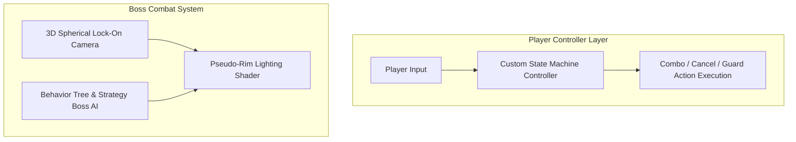

## 게임의 핵심 컨셉 및 스토리 요약

XSBD에서 한국IT직업전문학교 게임기획학과 교수님들과의 협의 하에 해당 학과 학생들의 G-Star 전시 작품 제작 지원을 진행한 사례입니다. 실시간으로 변경되는 기획에 빠르게 적응 가능한 결과물을 구현하는 데 집중하기 위해 가소성 높은 프레임워크를 만들어 제공했습니다.

## 메인 게임플레이 루프 및 핵심 메커니즘

다양한 적과 보스를 물리치는 것을 목표로 하는 소울라이크 액션 게임입니다. (Dead Line 프로젝트보다 1년 먼저 진행했습니다.) 몰입감 있는 보스 전투와 다채로운 전투 경험을 제공하는 것을 메인 목표로 하며, 플레이어는 스태미나를 관리하면서 콤보 공격, 캔슬링, 방어 등의 적절한 행동 조합을 통해 보스의 패턴을 공략해야 합니다.

### 시스템 아키텍처 다이어그램

## 적용된 개발 방법론

1주 단위 애자일 스프린트 및 이중 소통 채널 기반 협업 프로세스 (1-Week Agile Sprint & Dual-Channel Collaboration)

프로젝트를 1주 단위의 짧은 애자일 스프린트(Agile Sprint)로 나누어 진행했습니다. 정기 스프린트 회의를 통해 지난 주차의 상세 작업 내역을 리뷰하고, 프로젝트 완성을 위해 필요한 기능적 요구사항과 백로그를 정밀하게 산정해 다음 주차 일정에 할당했습니다.

또한 개발 진행 중 이슈나 미처 예상치 못한 문제로 인해 불필요한 시간이 소모되는 것을 방지하기 위해 디스코드(Discord)와 카카오톡(KakaoTalk) 2개 이상의 이중 커뮤니케이션 채널을 상시 가동하여 실시간으로 이상 유무를 공유하고 즉각적으로 피드백을 주고받는 협업 프로세스를 유지했습니다.

## 구현에 필요했던 주요 시스템 목록

이를 위해 다음 시스템들을 만들었습니다:
1. 플레이어 컨트롤러 및 커스텀 상태 기계(State Machine) 프레임워크
2. 높은 체공 기믹에 대응하는 3인칭 락온(Lock-on) 카메라 시스템
3. Behavior Tree 및 Strategy 패턴 기반 보스 AI
4. 어두운 환경에서의 식별을 위한 Normal Map 기반 Pseudo-Rim Lighting 셰이더

## 핵심 시스템의 세부 구현 방식

플레이어 컨트롤러는 각 상태별 특성을 정의할 수 있는 아키텍처를 구축하고 State 패턴을 도입했습니다. 이를 통해 '공격-공격(최대 3회 콤보)', '공격-회피(캔슬링)', '방어-강공격(선 딜레이 감소)' 등 상황에 맞는 행동 조합과 애니메이션을 효율적으로 매칭하고 밸런싱할 수 있도록 프레임워크화했습니다.

3인칭 시점의 락온 로직에서는 보스가 너무 높이 체공할 때 플레이어가 보스의 캐릭터에 가려지는 문제가 있었습니다. 이를 해결하기 위해 카메라의 기초 시점을 고정한 뒤 가상의 구면 상에서 움직이도록 구현했습니다. 보스의 위치가 화면 중앙에 충분히 가까운 상하좌우 범위를 적용하여 보스가 화면 중앙을 자연스럽게 벗어나도록 유도함으로써 플레이어가 항상 일정한 화면 비율을 차지하도록 가림 문제를 해결했습니다. 또한, 어두운 영역에서 캐릭터가 보이지 않는 문제는 Normal Map 기반 Pseudo-Rim Lighting 셰이더를 적용해 외곽선에 희미한 반사광이 맺히도록 시각화했습니다.

## 개발 후기

보스 AI는 Behavior Tree와 Strategy 패턴을 결합하여 체력이나 거리에 따라 공격 패턴이 동적으로 변화하도록 구현했습니다. 소울라이크 특유의 섬세한 조작감과 전투 몰입감을 높이기 위해 많은 고민을 했던 프로젝트였습니다. 특히 카메라의 구면 이동 처리나 셰이더를 활용한 시각화, 상태 기계 정의를 통해 콤보 및 캔슬링 메커니즘을 깔끔하게 구조화한 프로젝트입니다.

## 시연 영상 및 관련 링크

* 🎬 [Fallen Knight Trailer](https://www.youtube.com/watch?si=1Ra0hod_yN1MkXBW&v=mjPgl4YIr8M&feature=youtu.be)