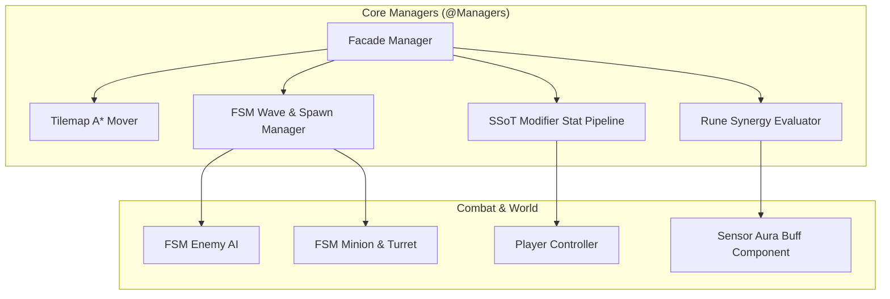

## 게임의 핵심 컨셉 및 스토리 요약

XSBD에서 한국IT직업전문학교 게임기획학과 교수님들과의 협의 하에 해당 학과 학생들의 G-Star 전시 작품 제작 지원을 진행한 사례입니다. 무거운 시스템 사양을 효율성 있게 재현할 수 있는 결과물을 구현하는 데 집중했습니다.

## 메인 게임플레이 루프 및 핵심 메커니즘

적들이 상단과 하단 두 갈래 길에서 계속 쏟아져 들어오는 상황에서, 주인공 캐릭터를 조작해 라인을 오가며 자동으로 스폰되는 아군 및 자동 포탑과 함께 적들을 방어하는 2D 라인 디펜스 액션 RPG 게임입니다. 적의 공세에 맞춰 포탑 수리나 용병 고용에 필요한 재화를 운용하고, 적들이 드롭하는 룬(Relic)을 최대 5개까지 장착하여 속성 조합 시너지 버프를 활용하는 메인 게임플레이 루프를 가지고 있습니다.

## 적용된 개발 방법론

1주 단위 애자일 스프린트 및 이중 소통 채널 기반 협업 프로세스 (1-Week Agile Sprint & Dual-Channel Collaboration)

프로젝트를 1주 단위의 짧은 애자일 스프린트(Agile Sprint)로 나누어 진행했습니다. 정기 스프린트 회의를 통해 지난 주차의 상세 작업 내역을 리뷰하고, 프로젝트 완성을 위해 필요한 기능적 요구사항과 백로그를 정밀하게 산정해 다음 주차 일정에 할당했습니다.

또한 개발 진행 중 이슈나 미처 예상치 못한 문제로 인해 불필요한 시간이 소모되는 것을 방지하기 위해 디스코드(Discord)와 카카오톡(KakaoTalk) 2개 이상의 이중 커뮤니케이션 채널을 상시 가동하여 실시간으로 이상 유무를 공유하고 즉각적으로 피드백을 주고받는 협업 프로세스를 유지했습니다.

## 구현에 필요했던 주요 시스템 목록

이를 위해 다음 시스템들을 만들었습니다:
1. Tilemap A* 경로 탐색 기반 상/하단 라인 이동 및 플레이어 컨트롤 시스템
2. FSM 기반의 상/하단 라인 적 웨이브 및 아군 스폰/AI 전투 시스템
3. 자동 포탑 내구도 관리, 파괴 및 재화 수리 시스템
4. 적 처치 및 시간 경과에 따른 재화(Gold) 산출 및 용병 고용 매니저
5. 최대 5개 슬롯 룬 장착 및 속성 카운팅 기반 세트 시너지 버프 시스템
6. SSoT(Single Source of Truth) 기반 Modifier 반응형 스탯 파이프라인
7. 컴포넌트 단위로 독립 캡슐화된 위치/센서 기반 오라(Aura) 버프 시스템

## 핵심 시스템의 세부 구현 방식

스탯 시스템의 경우, 고유 Modifier ID를 이용해 합산 및 비율 버프/디버프의 중첩 연산을 표준화하고, C# Event 기반 Observer 패턴으로 스탯 변동 시 UI와 전투 컴포넌트가 수동 폴링 없이 즉시 동기화되도록 구축했습니다. 룬 시너지 시스템은 장착 속성 카운팅과 조건 검사 로직을 독립된 클래스로 완전히 분리했습니다. 룬 장착/해제 시점에만 조건 검사를 진행하고, 활성/비활성 상태가 전환될 때만 이벤트를 발행하도록 설계하여 불필요한 프레임 연산을 최소화했습니다.

또한 @Managers 파사드(Facade) 매니저 패턴을 구축해 도메인별 관리자 진입점을 일원화했으며, 타일맵 A* 경로 탐색 알고리즘과 이동 로직을 분리하여 지형이나 이동 방식이 바뀌어도 경로 연산에 영향을 주지 않도록 구현했습니다.

## 개발 후기

라인 디펜스와 액션 RPG 요소를 결합한 메커니즘을 반응형 스탯 파이프라인, 모듈화된 룬 시너지 검사기, 그리고 독립된 오라 센서 컴포넌트 구조로 깔끔하게 구조화하여 확장성 있게 완성해 본 의미 있는 개발 경험이었습니다.