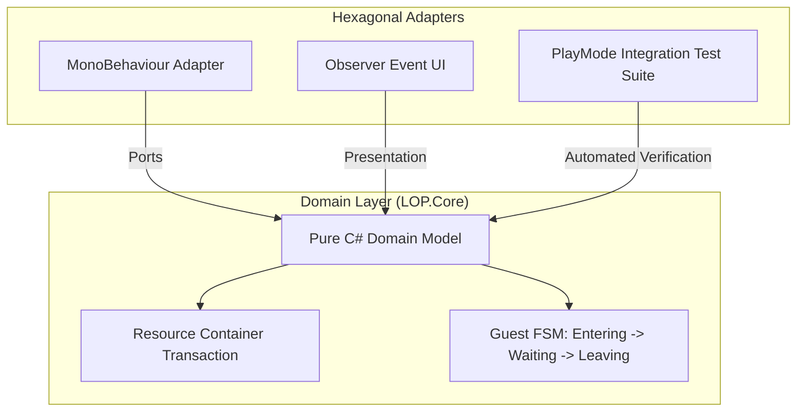

## 게임의 핵심 컨셉 및 스토리 요약

XSBD에서 미국에 위치한 Ussistant Studio와의 협의 하에 공동 개발을 진행 중인 프로젝트입니다. 현재는 프레임워크 개발 단계입니다.

## 메인 게임플레이 루프 및 핵심 메커니즘

캐주얼한 접근성과 독창적인 경영/자원 관리 메커니즘을 융합한 3D 타이쿤 게임입니다 (현재 개발 3주차 프로토타입 단계). 별도의 스테이지 구분이나 페널티 없이 이동키 단일 조작(근접 자동 판정)으로 채집, 조리, 판매, 고용, 확장 등 코어 루프 전체를 연속적으로 수행하는 구조를 목표로 개발 중입니다. 자원 채취지와 손님 카운터를 제외한 모든 시설을 자유롭게 배치하고, 10초 내외의 작은 구역(District) 단위 순환을 확장해 나가며 플레이어가 위치한 구역의 생산량이 2배가 되는 플레이어 주둔 버프 메커니즘을 핵심 게임플레이 루프로 삼고 있습니다.

## 적용된 개발 방법론

블리자드식 툴 구축-조립 개발 방법론 및 이중 소통 채널 관리 (Blizzard-style Tooling Workflow & Dual-Channel Support)

개발자들이 게임 빌딩 툴을 만들고 기획자들이 게임을 직접 조립해 보는 블리자드식 개발 방법론을 적용했습니다. 

스프린트 회의를 거쳐 프로젝트 완성을 위한 기능 백로그와 요구사항을 산정했으며, 디스코드(Discord)와 카카오톡(KakaoTalk) 2개 이상의 소통 채널을 활용해 실시간으로 이상 유무를 공유하고 개발 문제로 인한 오버헤드를 사전에 차단했습니다.

## 구현에 필요했던 주요 시스템 목록

이를 위해 초반 기반 시스템으로 다음 요소들을 구축했습니다:
1. 모듈 간 의존성을 배제한 도메인 중심의 헥사고날 아키텍처(Hexagonal Architecture) 적용
2. 물리적 실체를 갖춘 ResourceContainer 간 트랜잭션(Transaction) 자원/재화 시스템
3. Input/Output 컨테이너 연동 기반 자동 조리 및 스택 제어 프로세서 시스템
4. 방향성 판단 기반 근접 자동 채집 및 어군 수영/타격감 연출 시스템
5. ScriptableObject(UnlockDefinition) 및 구독 기반 구역 확장/NPC 고용 서비스
6. 핵심 데이터 변화만 구독하여 렌더링하는 Event 기반 UI/Presentation 계층
7. PlayMode 기반 핵심 루프 검증을 위한 자동화 통합 테스트 스위트

## 핵심 시스템의 세부 구현 방식

아키텍처 측면에서는 헥사고날 아키텍처(Ports and Adapters) 개념을 엄격하게 반영했습니다. 게임의 핵심 수치 연산과 상태 판정을 담당하는 순수 C# 도메인 모델(LOP.Core)을 중앙에 두고, 유니티 엔진 사이클(MonoBehaviour) 및 화면 렌더링(LOP.Presentation)을 외부 어댑터(Adapter) 형태로 결합했습니다. 서로 다른 모듈을 서로 다른 작업자가 관리하는 상황에서 엄격한 의존성 배제를 통해 개발 안정성과 자유도를 극대화했습니다.

재화 및 자원 로직은 단순히 수치를 더하는 방식이 아니라 물리적인 이동 트랜잭션 구조로 구현했습니다. 돈이 등에 쌓이거나 솥에 들어가 손님에게 전달되는 시각적 쾌감을 시스템 단에서 완벽히 뒷받침하게 만들었습니다. 또한, 개발 초기 단계부터 플레이모드 기반의 통합 테스트 스위트(WhiteoutCoreLoopIntegrationTests)를 도입하여 밸런싱 수정 시에도 시스템의 안정성을 즉각 검증할 수 있게 구축했습니다.

3주차라는 개발 기간 동안 헥사고날 아키텍처와 트랜잭션 자원 시스템, 그리고 자동화 테스트 스위트를 구축하여 장기 개발 및 확장을 위한 아키텍처 기반을 완성한 프로젝트입니다.

## 개발 후기

본 프로젝트는 개발자들이 게임 빌딩 툴을 만들고 기획자들이 게임을 직접 조립해 보는 블리자드식 개발 방법론을 시범적으로 적용하고 분석해보기 위한 부차적 목적을 달성하기 위해, 컨텐츠 구현 단계로 넘어가 비 프로그래머 개발자용 유틸리티를 구현하고 있는 중입니다.

## 관련 링크

* 🌐 [Ussistant Studio | game development](https://www.ussistantstudio.com/)
