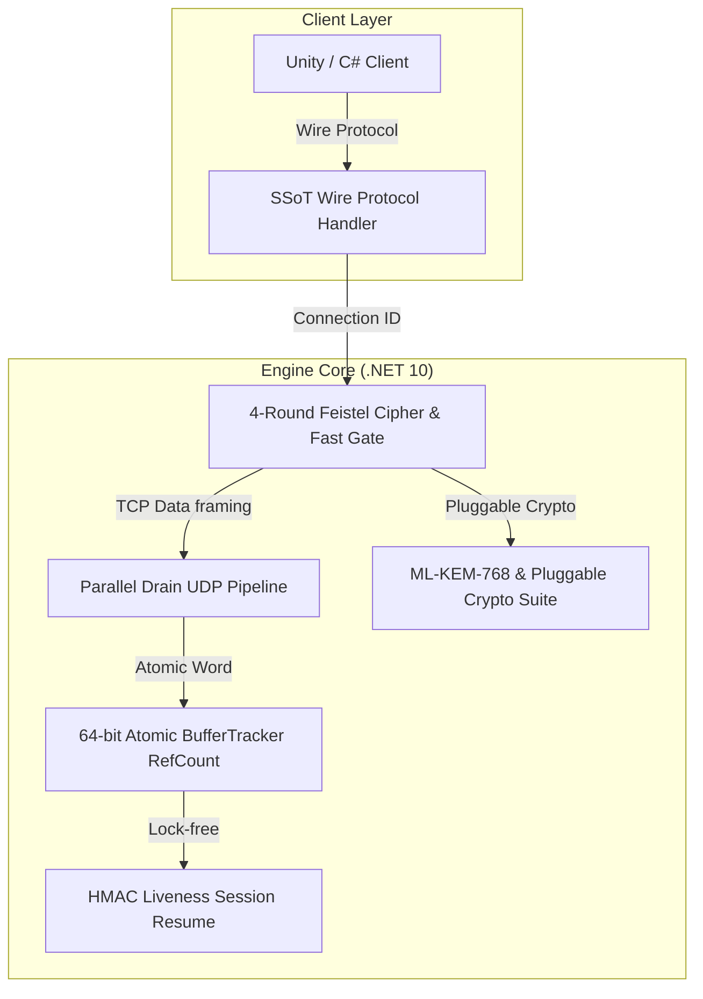

## 프로젝트의 핵심 컨셉 및 개발 목적

기존 유니티 상 네트워킹 시스템의 경직성으로 인해 일정 이상의 크기를 가진 패킷의 전송, 또는 로그인 정보 등 민감한 정보의 암호화 구현이 지원되지 않는다는 점에서 수요를 예측하고, 이에 안정적이고 빠른 속도의 연결을 가능케 하는 결과물을 구현하는 데 집중했습니다.

## 핵심 아키텍처 및 메인 설계 방향

.NET 10 기반으로 개발되었으며, 유니티 환경에서도 구동 가능하도록 설계된 고성능 대칭형 Dual TCP + UDP 하이브리드 네트워킹 엔진입니다. 엔진을 사용하는 개발자의 자유도를 최대한 보장하는 것을 최우선 목표로 삼았습니다. 철저한 계층화(Layered Architecture)를 통해 각 프로젝트의 필요에 따라 특정 부품은 직접 구현해 끼워 넣고 불필요한 기능은 제외할 수 있는, 진정한 의미의 '객체지향적 탈착형 아키텍처'를 구현했습니다. C#의 고질적인 문제인 Gen2 GC의 개입을 예방하기 위해 메모리 할당을 극도로 제한했습니다.

### 시스템 아키텍처 다이어그램

## 적용된 개발 방법론

1인 전담 코어 개발 및 단계적 프레임워크 확장 프로세스 (Sole-Developer Core Architecture Workflow)

LIVE DTS 프로젝트는 엔진의 높은 개발 난이도와 기술적 복잡도를 고려하여 동아리 내 최고 경험 수준의 1인 단독 전담 개발 방식으로 진행되었습니다.

단독 개발 환경에서 커뮤니케이션 오버헤드를 최소화하고 아키텍처의 철저한 객체지향적 결합도와 성능 최적화(.NET 10 Dual TCP+UDP, 64비트 아토믹 BufferTracker 등)를 빠르게 완성했습니다. 일관된 코드 품질 관리를 바탕으로 코어 프레임워크 확정을 완료한 후, 이식 단계 및 편의성 기능 구현을 위해 동아리 내부에서 참여 인원을 추가 모집하고 확장하는 단계를 밟았습니다.

## 구현에 필요했던 주요 시스템 목록

이와 함께 클라이언트와 서버 간 프로토콜 불일치(Drift) 및 메모리 누수/UAF(Use-After-Free) 같은 고질적인 네트워크 이슈를 차단하기 위해 다음 시스템들을 만들었습니다:
1. SSOT(Single Source of Truth) 기반 인코딩/디코더 및 설정 다이제스트 검증 시스템
2. Connection ID 기반 Parallel 드레인 및 멀티테넌트 격리 UDP 파이프라인
3. 4-Round Feistel 순열 기반 Connection ID 암호화 및 Hole-Punch Fast Gate 보안 스위트
4. 암호화 모듈을 개발자 재량껏 선택·개발·시험할 수 있는 플러그인형 암호화 계층(Pluggable Crypto Suite, ML-KEM-768 기본제공, 엔진에 포함된 인터페이스를 상속해 커스텀 암호화를 간편하게 구현 가능)
5. Generation/RefCount 64비트 아토믹 워드 기반의 UAF 차단 버퍼 트래커(BufferTracker)
6. 백그라운드 스레드 락이 없는 활동 기반 Liveness 및 HMAC 세션 복구(Resume) 시스템
7. 세부 드롭 사유 카운터 기반 텔레메트리 시스템

## 핵심 시스템의 세부 구현 방식

와이어 프로토콜 표준화를 단일 모듈로 일원화하고, 연결 수립 시점에 8바이트 다이제스트 값을 상호 검증해 설정 미스매치를 사전에 차단하게 만들었습니다. UDP 수신 측에서는 단일 소켓 병목을 피하기 위해 Connection ID 기반 수신 큐 분리를 적용했으며, 스레드 풀에서 AEAD 해독 및 재조합을 병렬로 처리하여 동일 연결 내 순서 보장과 서로 다른 연결 간 병렬 처리를 동시에 달성했습니다. 또한 피어별 큐 예산을 독립 제어하여 악의적인 UDP 플러드 공격이 들어오더라도 타 세션의 통신을 방해하지 못하도록 격리했습니다.

메모리 관리 측면에서는 풀링된 버퍼의 Double-Free 및 UAF 문제를 방지하기 위해 단일 64비트 아토믹 워드 연산으로 버퍼 상태를 추적하는 버퍼 트래커를 도입하여 패킷당 약 15~30ns 수준의 극소 오버헤드로 메모리 안정성을 확보했습니다.

## 개발 후기

네트워크 엔진의 저전력·고성능 처리와 보안, 그리고 유니티 환경에서의 유연성까지 동시에 확보해야 했기에 치밀한 고민과 매우 높은 개발 난이도가 요구되어 동아리 내 개발 경험이 가장 많은 인원이 단독으로 투입되었던 프로젝트였습니다. 암호화 모듈을 비롯한 엔진의 주요 요소를 개발자가 직접 구현하고 교체할 수 있도록 모듈화하여, 높은 수준의 객체지향적 아키텍처와 사용자 자유도를 완성해낸 의미 있는 개발 경험이었습니다.
본 프로젝트는 높은 경험 수준을 요하는 프로젝트로, 1인 투입을 통해 프레임워크를 확정하고 LIVE DTS 이식 단계를 지나 편의성 기능을 구현하기 위해 동아리 내부에서 참여 인원을 추가 모집할 예정입니다.