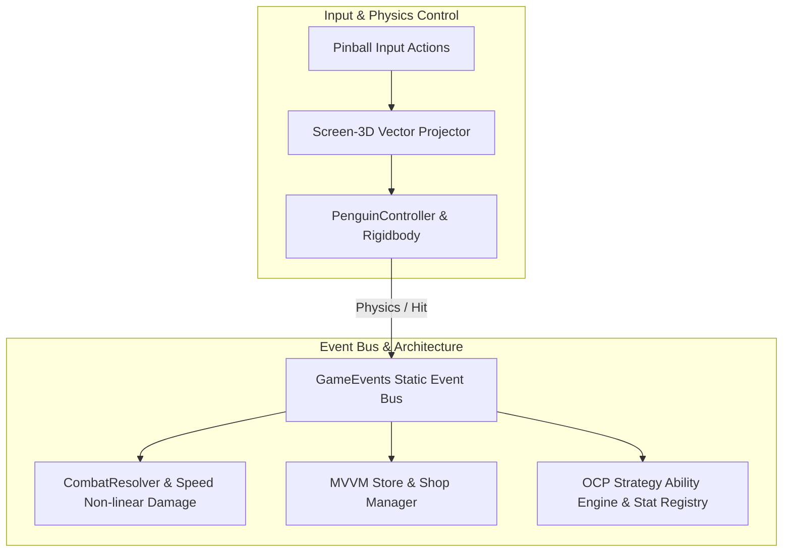

## 게임의 핵심 컨셉 및 스토리 요약

XSBD에서 한국IT직업전문학교 게임기획학과 기획자분과의 협의 하에 공동 개발을 진행 중인 프로젝트입니다. 현재는 프레임워크 개발 단계입니다.

## 메인 게임플레이 루프 및 핵심 메커니즘

펭귄을 핀볼처럼 튕겨내며 맵 상에서 움직이는 적들을 소탕하는 핀볼 메커니즘 기반의 게임입니다. 맵 상에 튕김이 좋은 오브젝트(Bumper)를 배치하여 반사 횟수를 늘리거나, 펭귄에게 장비를 주어 특수 능력을 부여하고 웨이브와 상점 시스템을 거치는 구조를 채택하고 있습니다. 이벤트 기반의 결합도 최소화와 전략 패턴을 통한 능력 확장, 그리고 UI와 비즈니스 로직의 명확한 분리를 메인 개발 기조로 삼았습니다.

### 시스템 아키텍처 다이어그램

## 적용된 개발 방법론

블리자드식 툴 구축-조립 개발 방법론 및 이중 소통 채널 관리 (Blizzard-style Tooling Workflow & Dual-Channel Support)

개발자들이 게임 빌딩 툴을 만들고 기획자들이 게임을 직접 조립해 보는 블리자드식 개발 방법론을 시범적으로 적용했습니다. 

스프린트 회의를 통해 프로젝트 완성을 위한 기능 백로그와 요구사항을 산정했으며, 개발 중 이슈를 방지하고 실시간으로 이상 유무를 공유하기 위해 디스코드(Discord)와 카카오톡(KakaoTalk) 2개 이상의 소통 채널을 상시 운용했습니다.

## 구현에 필요했던 주요 시스템 목록

이를 위해 다음 시스템들을 만들었습니다:
1. 도메인 이벤트 버스 및 상태 기반 이벤트를 통한 이벤트 주도 아키텍처(Event-Driven Architecture)
2. UI 최적화 및 비즈니스 로직 분리를 위한 MVVM 패턴 기반 상점 시스템
3. 전략 패턴 및 OCP 원칙 기반의 펭귄 특수 능력 확장에 맞춰진 컴포넌트 아키텍처
4. 동적 모디파이어(Flat/Multiplier) 중첩 계산이 가능한 중앙 집중형 스탯 레지스트리 시스템
5. 전투 데미지 연산 전문 해석기 및 스크린-3D 좌표 투영 기반 발사 제어 로직

## 핵심 시스템의 세부 구현 방식

전체 아키텍처 측면에서는 GameEvents를 통한 중앙 집중식 static event 관리로 물리, 데미지, 스폰 이벤트를 중계하여 시스템 간 직접 참조를 원천 차단했습니다. 상점 UI 영역에는 MVVM 패턴을 적용해 UI 표현과 비즈니스 로직을 완벽히 분리함으로써 유니티 특유의 UI-로직 강결합 문제를 방지했습니다. 또한, 펭귄 능력 연산 시 전략 패턴 기반 인터페이스를 적용해 신규 펭귄 타입 추가 시 기존 코드를 수정하지 않는 개방-폐쇄 원칙(OCP)을 준수했습니다.

데미지 공식 연산 역시 독립시켜 속도에 따른 비선형 데미지 곡선과 취약 표식 메커니즘을 깔끔하게 모듈화했습니다. 이벤트 기반 디커플링, MVVM UI 아키텍처, 전략 패턴 기반의 유닛 확장성, 그리고 동적 스탯 모디파이어 시스템을 조화롭게 결합하여 수십 종의 특수 능력과 유물 조합이 유연하게 확장될 수 있는 단단한 핀볼 디펜스 아키텍처 기반을 완성해가고 있으며, 현재 개발 완료된 적 스폰 및 이동 시스템의 병합을 끝으로 프레임워크를 완성할 예정입니다.

## 개발 후기

본 프로젝트는 개발자들이 게임 빌딩 툴을 만들고 기획자들이 게임을 직접 조립해 보는 블리자드식 개발 방법론을 시범적으로 적용하고 분석해보기 위한 부차적 목적을 달성하기 위해 컨텐츠 구현 단계로 넘어갈 예정입니다.