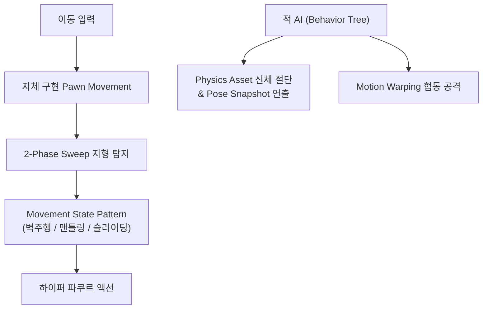

## 게임의 핵심 컨셉 및 스토리 요약

XSBD에서 한국IT직업전문학교 게임기획학과 교수님들과의 협의 하에 해당 학과 학생들의 G-Star 전시 작품 제작 지원을 진행한 사례입니다. 무거운 시스템 사양을 효율성 있게 재현할 수 있는 결과물을 구현하는 데 집중했습니다.

## 메인 게임플레이 루프 및 핵심 메커니즘

무너진 도시에서 벽을 타고 날아다니며 미지의 적을 섬멸하는 1인칭 하이퍼 FPS(Hyper FPS) 게임입니다. 단순한 슈팅을 넘어 속도감 있고 역동적인 움직임 자체가 곧 무기이자 생존 전략이 되는 고속 액션을 메인 게임플레이 루프로 삼고 있습니다.

## 적용된 개발 방법론

1주 단위 애자일 스프린트 및 이중 소통 채널 기반 협업 프로세스 (1-Week Agile Sprint & Dual-Channel Collaboration)

프로젝트를 1주 단위의 짧은 애자일 스프린트(Agile Sprint)로 나누어 진행했습니다. 정기 스프린트 회의를 통해 지난 주차의 상세 작업 내역을 리뷰하고, 프로젝트 완성을 위해 필요한 기능적 요구사항과 백로그를 정밀하게 산정해 다음 주차 일정에 할당했습니다.

또한 개발 진행 중 이슈나 미처 예상치 못한 문제로 인해 불필요한 시간이 소모되는 것을 방지하기 위해 디스코드(Discord)와 카카오톡(KakaoTalk) 2개 이상의 이중 커뮤니케이션 채널을 상시 가동하여 실시간으로 이상 유무를 공유하고 즉각적으로 피드백을 주고받는 협업 프로세스를 유지했습니다.

## 구현에 필요했던 주요 시스템 목록

이를 위해 다음 시스템들을 만들었습니다:
1. 언리얼 엔진 5 기본 움직임을 대체하는 커스텀 폰 무브먼트(Pawn Movement)
2. 곡면 및 코너 반응형 벽면 주행(Wall Running) 알고리즘
3. 2-Phase Sweep 기반 지형 반응형 맨틀링(Mantling) 시스템
4. 대시/슬라이딩/더블점프 등을 제어하는 무브먼트 상태 패턴(Movement State Pattern)
5. 전술적 협동 및 입체적 경로 탐색을 지원하는 적 AI 시스템
6. 물리 기반 신체 절단(Physics Dismemberment) 및 비헤이비어 트리(Behavior Tree) 최적화

## 핵심 시스템의 세부 구현 방식

언리얼 엔진 5 기본 Character Movement의 한계를 극복하고 하이퍼 FPS 특유의 정밀하고 즉각적인 조작감을 얻기 위해, 불필요한 로직을 덜어낸 자체 구현 Pawn Movement를 개발했습니다. Capsule/Sphere Sweep의 복합 활용으로 90도 코너나 곡면 지형에서도 끊김 없이 벽을 타는 algorithms을 구축했으며, 전방-하방 2-Phase Sweep으로 맨틀링 지점을 정확히 탐지하고 지형 경사각에 따라 속도와 자세를 보정하도록 구현했습니다. 플레이어의 모든 움직임은 Movement State Pattern으로 상태화하여 유기적인 전환이 가능하게 했습니다.

적 AI 영역에서는 플레이어에게 접근할 수 없을 때 동료를 집어던지는 전술적 협동 공격(Motion Warping 활용)과 Navigation Link를 응용해 벽을 오르고 넘나드는 입체적 경로 탐색을 구축했습니다. 최적화 면에서는 Physics Asset 기반 bone 단위 피격 판정과 오브젝트 풀링, Animation Pose Snapshot을 결합하여 고성능 신체 절단 연출을 구현했고, Node Memory 최적화를 적용해 단일 Behavior Tree 에셋만으로 다수 AI의 데이터를 독립적으로 효율 관리하도록 설계했습니다.

## 개발 후기

빠른 템포의 하이퍼 FPS 장르에 맞춰 엔진의 기본 무브먼트 프레임워크를 넘어선 커스텀 폰 무브먼트를 직접 구축하고, 입체적인 파쿠르 액션과 고성능 적 AI 최적화까지 성공적으로 이끌어낸 프로젝트였습니다.

## 시연 영상 및 관련 링크

* 🎬 [[The Second War] Short Montage](https://www.youtube.com/watch?v=B6Pg1OIroto)
