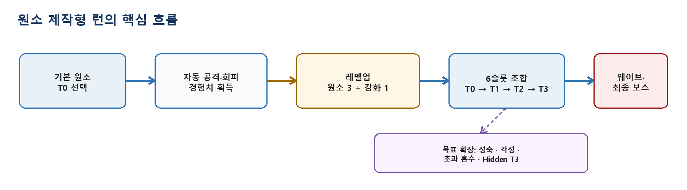
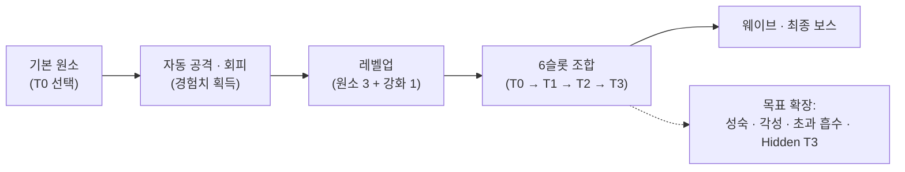

## 게임의 핵심 컨셉 및 스토리 요약

원소를 조합해 스킬을 제작하는 뱀서라이크 게임입니다.

> **한 문장 평가**: 무작위로 제시되는 원소를 6개 슬롯 안에서 결정론적으로 조합하는 구조가 가장 강한 차별점이다. 현재는 이를 검증할 수 있는 전투 프로토타입 기반이 갖춰졌으며, 다음 단계는 스킬 수보다 원소별 고유성·조합 피드백·후반 성장 연결을 완성하는 것이다.

## 메인 게임플레이 루프 및 핵심 메커니즘

### 원소 제작형 런의 핵심 흐름

### 게임 내용과 의도한 플레이 경험
플레이어는 불·물·대지·바람 중 기본 T0 스킬을 선택해 런을 시작한다. 적을 처치해 경험치를 얻고, 레벨업 때 원소 카드 3장과 강화 카드 1장 중 하나를 고른다. 원소는 최대 6개 슬롯에서 T0→T1→T2→T3로 조합된다.

- **초반**: 제시된 카드로 이번 런의 주력 원소를 탐색한다.
- **중반**: 6슬롯 압박 속에서 재료 보존과 조합 순서를 계획한다.
- **후반**: T2/T3 완성으로 전투 방식이 크게 전환되고 최종 보스에 도전한다.
- **목표 경험**: 우연히 강한 스킬을 받는 것보다 불완전한 재료로 원하는 결과를 설계한다.

### 핵심 콘텐츠 규모

| 원소 | Forge 스킬 | 스킬 슬롯 | 목표 런 |
| :---: | :---: | :---: | :---: |
| 8종 | 59종 정의 / 57종 전투 가능 | 최대 6개 | 15분 + 최종 보스 |

## 적용된 개발 방법론

1주 단위 애자일 스프린트 및 이중 소통 채널 기반 협업 프로세스 (1-Week Agile Sprint & Dual-Channel Collaboration)

프로젝트를 1주 단위의 짧은 애자일 스프린트(Agile Sprint)로 나누어 진행했습니다. 정기 스프린트 회의를 통해 지난 주차의 상세 작업 내역과 프로젝트 완성을 위해 필요한 기능적 요구사항과 백로그를 정밀하게 산정해 다음 주차 일정에 할당했습니다.

또한 개발 진행 중 이슈나 미처 예상치 못한 문제로 인해 불필요한 시간이 소모되는 것을 방지하기 위해 디스코드(Discord)와 카카오톡(KakaoTalk) 2개 이상의 이중 커뮤니케이션 채널을 상시 가동하여 실시간으로 이상 유무를 공유하고 즉각적으로 피드백을 주고받는 협업 프로세스를 유지했습니다.

## 구현에 필요했던 주요 시스템 목록

실제로 잘 된 아키텍처 및 주요 시스템:
1. **스킬 정의와 실행 분리**: Forge 카탈로그가 59개 스킬의 ID·티어·원소·시전 형태를 관리하고 기존 SkillInfo/SkillData 체계로 변환한다.
2. **전투 확장성**: 상태 효과의 병합·우선순위·틱·만료를 적 본체에서 분리하고 이동·전투 통제를 결과 객체로 합성한다.
3. **장르 대응 성능**: 적·스킬 오브젝트 풀링과 NonAlloc 물리 판정으로 대량 전투를 고려했다.
4. **디자이너와 데이터 지원**: Timeline 기반 웨이브 편집과 StatisticsCollector를 통해 전투 밀도와 빌드 성능을 반복 검증할 수 있다.

## 핵심 시스템의 세부 구현 방식

### 현재 완성도의 경계 및 구조 분석

| 영역 | 현재 판단 |
| :--- | :--- |
| **스킬 고유성** | 대부분 10종 공통 시전 형태와 범용 수치를 공유해 이름에 비해 전투 차이가 작다. |
| **후반 성장** | 성숙·각성·초과 흡수 API는 있으나 일반 플레이 호출 경로가 완전히 연결되지 않았다. |
| **Hidden T3** | 정의는 존재하지만 정상 Forge 레시피로 획득하는 경로가 확인되지 않는다. |
| **구조 부채** | 비활성 레거시 주머니 코드가 남아 있고 PlayerAttack에 조합·슬롯·생성 책임이 집중돼 있다. |

### 우선 실행 방향

| 순위 | 실행 방향 | 완료 판단 |
| :---: | :--- | :--- |
| **P0** | 불 계보 하나를 T0→T3까지 고유 규칙·VFX·사운드·성숙·각성으로 종단 완성 | 이 게임만의 손맛과 제작 기준 확보 |
| **P0** | 카드 선택 전 조합 결과·결합 슬롯·다음 재료를 UI로 예고 | 외부 조합표 없이 다음 융합 예측 |
| **P0** | 원소·정수·맵 임무를 RunBuildState 같은 단일 권위 모델로 분리 | PlayerAttack은 공격 실행에 집중 |
| **P1** | 불 폭발, 물 누적 회수, 대지 처형, 바람 집결 등 원소별 전투 문법 적용 | 영상만으로 원소별 플레이 구분 |
| **P1** | 첫 융합 시간·T2/T3 완성률·슬롯 교착·DPS·TTK를 통계로 튜닝 | 선택 다양성과 보스 도달률 안정화 |

## 개발 후기

**최종 제언**: 59개 스킬을 더 늘리기보다 한 원소 계보를 완성해 품질 기준을 먼저 만들고, 이를 나머지 원소로 확장한다.

## 시연 영상 및 관련 링크

* 🎬 [Soul of Elements 시연 영상 1](https://youtu.be/RJ_kDXyeFYc)
* 🎬 [Soul of Elements 시연 영상 2](https://youtu.be/sjOfnQ0oOW4)
