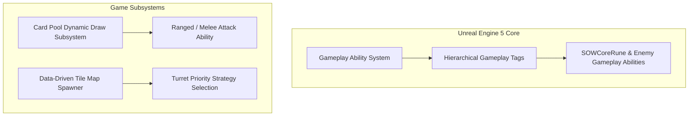

## 게임의 핵심 컨셉 및 스토리 요약

XSBD에서 미국에 위치한 Ussistant Studio와의 협의 하에 공동 개발을 진행 중인 프로젝트입니다. 현재는 프레임워크 개발 단계입니다.

## 사용된 주요 기술 스택

- **엔진 및 언어**: Unreal Engine 5 (UE5), C++
- **핵심 프레임워크**: Gameplay Ability System (GAS), Hierarchical Gameplay Tags
- **시스템 및 관리**: Data-Driven 스포너 구조, 다이내믹 카드 드로우 및 확률 풀 매니저

## 메인 게임플레이 루프 및 핵심 메커니즘

CCG처럼 카드가 랜덤하게 등장하고, 이 카드를 필드에 배치하면 타워 형태로 설치되는 Unreal Engine 5 기반의 타워 디펜스 게임입니다 (현재 개발 진행 중). 난이도 조절을 위해 현재 설치된 타워 풀(Pool)의 상태에 따라 각 카드의 등장 확률이 실시간으로 변동하는 동적 카드 드로우 체계를 핵심 게임플레이 루프로 삼고 있습니다. 또한, GAS(Gameplay Ability System)를 적극 응용하여 타워와 적 객체 간의 복잡한 상호작용을 효율적으로 처리하도록 설계하는 것에 주력하고 있습니다.

## 적용된 개발 방법론

클래식 타임박스 기반 주간 이터레이티브 개발 프로세스 (Classic Timeboxed Iterative Workflow)

2024년부터 2026년까지 진행되는 장기 개발 프로젝트의 안정적인 마일스톤 관리를 위해 1주 단위의 고정 타임박싱(Timeboxing) 이터레이션 방식을 적용했습니다.

특히 개발 참여 인원들이 학업 및 졸업 준비로 가용 시간이 넉넉하지 않았던 상황을 고려하여, 주간 스프린트 회의를 통해 프로젝트 완성을 위한 백로그와 작업량을 엄격히 산정했습니다. 또한 디스코드(Discord)와 카카오톡(KakaoTalk) 2개 이상의 소통 채널을 상시 가동하여 실시간으로 이상 유무를 공유하고 소통 오버헤드를 막았습니다.

## 구현에 필요했던 주요 시스템 목록

이를 위해 다음 시스템들을 만들었습니다:
1. 타워 풀(Pool) 연동 기반 동적 카드 등장 확률 변동 시스템
2. 언리얼 Gameplay Ability System(GAS) 기반 상태 이상(Taunt, Slow, Freeze 등) 및 능력 상호작용 시스템
3. 계층적 Gameplay Tags 기반의 유연한 상태 검사 및 시너지 제어 체계
4. 독립적인 서브시스템 및 매니저(원소 시너지, 소환, 특수 타워 매니저) 구조
5. 맵 스크립트 파일 연동 기반 데이터 주도(Data-Driven) 타일 및 레벨 생성 스포너

## 핵심 시스템의 세부 구현 방식

전략 장르 특성상 다양한 속성, 상태 이상, 시너지 효과가 지속적으로 추가될 수 있음을 고려하여, Character 및 타워에 GAS를 기본 탑재하고 Gameplay Tags를 세분화해 하드코딩 없이 확장성을 극대화했습니다. 또한 원소 시너지 매니저, 소환 매니저 등 핵심 로직을 독립된 모듈로 분리하여 코드 간 결합도를 낮췄으며, 외부 맵 스크립트를 로드해 타일을 생성하는 방식을 적용해 레벨 디자인을 데이터 주도적으로 유연하게 관리할 수 있도록 구축했습니다.

## 개발 후기

동적 확률 변동 알고리즘을 도입해 디펜스 게임의 밸런스를 조율함과 동시에, GAS와 Gameplay Tags 등 엔진의 고도화된 프레임워크를 적극 활용하여 확장성 높은 타워 디펜스 아키텍처 기반을 다져가고 있는 프로젝트입니다.

## 관련 링크

* 🌐 [Ussistant Studio | game development](https://www.ussistantstudio.com/)
