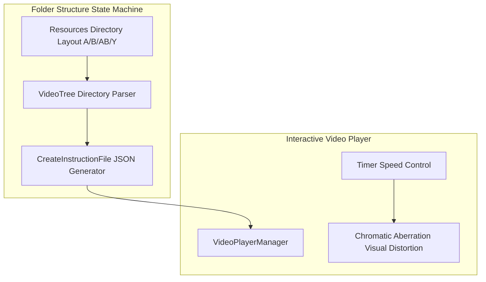

## 게임의 핵심 컨셉 및 스토리 요약

XSBD에서 경희대학교 예술디자인대학교 디지털콘텐츠학과 교수님들과의 협의 하에 해당 학과 학생 졸업작품 제작 지원을 진행한 사례입니다. 게임 프로젝트를 주로 편집하는 것이 프로그래밍에 익숙치 않은 팀원이라는 점을 감안하여 폴더 구조를 활용한 분기 시스템을 구현해 프로그래밍에 대한 이해를 요구하지 않고, 이해가 쉬운 프레임워크를 만들어 제공하는 데 집중했습니다.

## 메인 게임플레이 루프 및 핵심 메커니즘

분기별로 선택지에 맞는 영상을 재생해야 하는 인터랙티브 무비 / FMV(Full-Motion Video) 장르의 게임입니다. 키보드 기반의 분기 탐색 시스템을 핵심 게임플레이 루프로 삼고 있습니다. 당시 노드 기반 시각화 에디터 툴의 부재라는 시대적/기술적 한계를 극복하기 위해, 별도의 무거운 외부 플러그인 없이 유니티 Resources 폴더의 디렉토리 구조 자체를 상태 머신(State Machine) 및 트리 구조로 직접 활용하는 방식을 구축했습니다.

### 시스템 아키텍처 다이어그램

## 적용된 개발 방법론

1주 단위 애자일 스프린트 및 도구 주도 온디맨드 기술 지원 방법론 (1-Week Agile Sprint & Tool-Driven On-Demand Support)

아티스트의 졸업 작품 프로젝트 제작 지원이라는 특성을 염두에 두고, 프로그래밍에 익숙치 않은 팀원들이 직관적으로 분기 및 영상을 구성할 수 있도록 Resources 폴더 디렉토리 기반 상태 머신 및 JSON Instruction 자동 생성 툴 등 전용 도구와 기본 뼈대를 최우선으로 구축했습니다.

프로젝트 관리는 1주 단위 애자일 스프린트를 중심으로 주 2회 스크럼 미팅을 진행하며 스프린트 회의 시 프로젝트 완성을 위한 기능 백로그를 산정했습니다. 아울러 디스코드(Discord)와 카카오톡(KakaoTalk) 2개 이상의 소통 채널을 운영하여 실시간으로 이상 유무를 공유하고 온디맨드(On-Demand) 기술 지원을 제공했습니다.

## 구현에 필요했던 주요 시스템 목록

이를 위해 다음 시스템들을 만들었습니다:
1. Resources 디렉토리 구조 기반의 파일 시스템 연동 분기 트리 탐색 로직
2. 에디터 툴링(ExecuteInEditMode) 기반 JSON Instruction 자동 생성기 (CreateInstructionFile)
3. 타이머 연동 비디오 재생 속도 제어 및 화면 노이즈/색수차(Chromatic Aberration) 연출 시스템

## 핵심 시스템의 세부 구현 방식

기획자나 디자이너가 규칙에 맞는 이름을 가진 폴더(A(분기 1), B(분기 2), AB(입력에 상관없이 재생), Y(갈라진 분기 병합))에 영상 파일을 배치하기만 하면 분기 트리가 자동으로 가동되는 직관적인 디렉토리 구조 아키텍처를 설계하여 작업 파이프라인과 개발 효율성을 크게 끌어올렸습니다. 또한, 파일 수동 작성에 따른 오타와 번거로움을 방지하기 위해 유니티 에디터 인스펙터 상에서 클릭만으로 전용 JSON 데이터를 생성하는 에디터 툴을 개발해 팀 단위 작업 생산성을 확보했습니다.

영상 분기 시점에는 Timer와 연동하여 남은 시간에 비례해 비디오 재생 속도를 낮추고 visual distortion 연출을 더하는 등 인터랙티브 장르 특유의 시네마틱 UX 연출을 코드로 구현했습니다.

## 개발 후기

외부 노드 툴의 한계를 '디렉토리 기반 트리 구조'라는 창의적인 역발상으로 극복하고, 에디터 오토메이션 및 영상 연출 로직까지 직접 결합하여 한정된 자원 속에서 최적의 개발 파이프라인을 완성해 본 뜻깊은 개발 경험이었습니다.