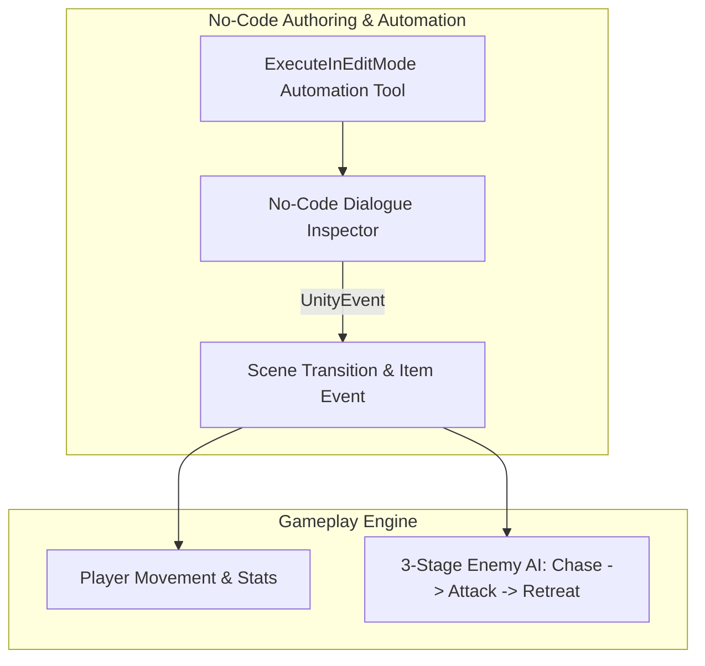

## 게임의 핵심 컨셉 및 스토리 요약

XSBD에서 경희대학교 예술디자인대학교 디지털콘텐츠학과 교수님들과의 협의 하에 해당 학과 학생 졸업작품 제작 지원을 진행한 사례입니다. 게임 프로젝트를 주로 편집하는 것이 프로그래밍에 익숙치 않은 팀원이라는 점을 감안하여 프로그래밍에 대한 이해를 요구하지 않는, 직관적인 에디터와 오류 발생 가능성을 최소화한 프레임워크를 만들어 제공하는 데 집중했습니다.

## 메인 게임플레이 루프 및 핵심 메커니즘

초~중반에는 다이얼로그 및 단서/오브젝트 수집을 진행하는 2D 워킹 시뮬레이터로 진행되다가, 후반부에는 시간 제한 내에 주어진 맵을 주파하고 탈출해야 하는 미션으로 이어지는 구조의 게임입니다. 머릿속에 위치 및 생명 통제용 칩이 이식되어 있는 피험자들이 24일이 되기 전 칩을 수술로 제거하고 의문의 연구소를 탈출해야 하는 스토리를 다루고 있습니다.

## 적용된 개발 방법론

1주 단위 애자일 스프린트 및 도구 주도 온디맨드 기술 지원 방법론 (1-Week Agile Sprint & Tool-Driven On-Demand Support)

아티스트의 졸업 작품 프로젝트 제작 지원이라는 특성을 염두에 두고, 비프로그래머인 팀원들이 프로그래밍 지식 없이도 컨텐츠를 자율적으로 제작할 수 있도록 노코드 대화 시스템 및 씬 조립 오토메이션 등 전용 도구와 기본 뼈대를 최우선으로 구축했습니다.

프로젝트 관리는 1주 단위의 애자일 스프린트를 중심으로 주 2회 스크럼 미팅 체계를 운용하여 스프린트 회의 시 프로젝트 완성을 위한 기능 요구사항과 백로그를 산정했습니다. 아울러 디스코드(Discord)와 카카오톡(KakaoTalk) 2개 이상의 소통 채널을 상시 가동하여 실시간으로 이상 유무를 공유하고 온디맨드(On-Demand) 형태의 기술 지원을 유연하게 제공했습니다.

## 구현에 필요했던 주요 시스템 목록

이를 위해 다음 시스템들을 만들었습니다:
1. 기획자 및 팀원들을 위한 노코드(No-Code) 대화 및 이벤트 연동 시스템
2. 후반부 탈출 전투를 위한 액션 연산 및 Enemy AI 시스템
3. 씬 조립 반복 작업을 줄이기 위한 에디터 오토메이션(Automation) 툴

## 핵심 시스템의 세부 구현 방식

노코드 대화 시스템의 경우 조건(Collision, Trigger, Start, Enable)을 인스펙터 상에서 클릭만으로 지정하고, 대사를 인스펙터 상에 노출된 필드에 입력하도록 설계하여 대화 종료 후 씬 전환이나 아이템 지급 등의 후속 이벤트를 UnityEvent로 드래그 한 번에 연결하도록 설계했습니다. 또한 데이터 연산과 UI 렌더링을 분리하고 자동 개행 처리를 구현해 작업 편의성을 높였습니다.

후반부 탈출 전투 미션에서는 플레이어와의 거리에 따라 추적, 공격, 거리 유지(뒷걸음질)로 이어지는 3단계 AI 상태 제어를 구현했습니다. 마우스 방향 벡터 기반 조준, 피격 방향에 따른 넉백 연출, 무적 시간 반투명 반사 처리 등 실용적인 액션 로직을 조합했습니다.

## 개발 후기

개발 과정에서는 수십 개의 컴포넌트를 일일이 부착해야 하는 씬 조립 작업을 효율화하기 위해 오토메이션 툴을 제작했습니다. [ExecuteInEditMode]를 활용해 씬 내 오브젝트의 이름 규칙을 자동 탐색하고, 말풍선 UI 생성 및 대화 부착 작업을 자동으로 집행하도록 구현했습니다. 팀원들의 작업 생산성을 높이기 위한 노코드 대화 시스템 및 에디터 오토메이션 툴을 직접 설계하여 개발 파이프라인을 효율화했던 경험입니다.